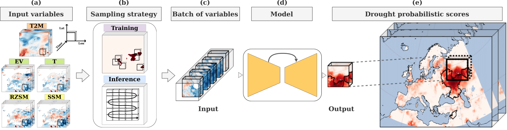
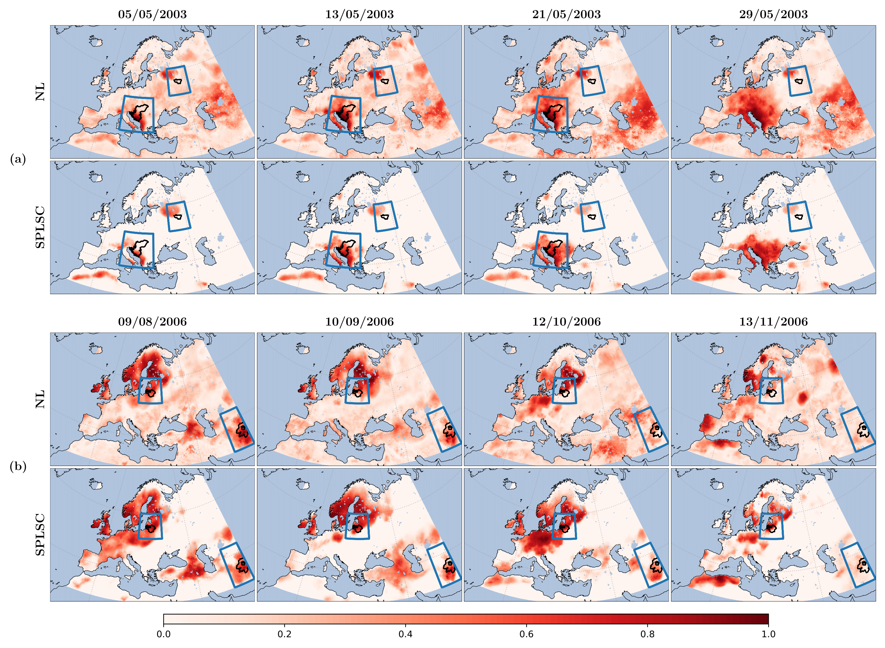

## Deep Learning with Noisy Labels for Spatio-Temporal Drought Detection

# Abstract
Droughts pose significant challenges for accurate monitoring due to their complex spatio-temporal characteristics. Data-driven machine learning models have shown promise in detecting extreme events when enough well-annotated data is available. However, droughts do not have a unique and precise definition, which leads to noise in human-annotated events and presents an imperfect learning scenario for deep learning models. This paper introduces a 3D convolutional neural network designed to address the complex task of drought detection, considering spatio-temporal dependencies and learning with noisy and inaccurate labels. Motivated by the shortcomings of traditional drought indices, we leverage supervised learning with labeled events from multiple sources, capturing the shared conceptual space among diverse definitions of drought. Additionally, we employ several strategies to mitigate the negative effect of noisy labels during training, including a novel label correction method that relies on model outputs, enhancing the robustness and performance of the detection model. Our model significantly outperforms state-of-the-art drought indices when detecting events in Europe between 2003 and 2015, achieving an AUROC of 72.28%, an AUPRC of 7.67%, and an ECE of 16.20%. When applying the proposed label correction method, these performances improve by +5%, +15%, and +59%, respectively. Both the proposed model and the robust learning methodology aim to advance drought detection by providing a comprehensive solution to label noise and conceptual variability.

# Model overview

Proposed deep learning processing pipeline for drought detection. (a) Input hydro-climatological variables: air temperature at 2 meters (T2M), evaporation (EV), transpiration (T), root-zone soil moisture (RZSM), and surface soil moisture (SSM). (b) Data cubes (outlined) from the variable maps. During training, samples are taken centered around drought labels (drought locations are highlighted in red). During inference, a sequential order is followed. (c) Batch of data cube variables, which constitutes each sample received as input by the model. (d) 3D convolutional encoder-decoder model for drought detection. (e) Probabilistic scores for drought detection at the output of the model.

# Qualitative results

Visual comparison of the performance of the ST-CED model trained with no label correction (NL) and the proposed SuperPixel-based Label Self-Correction (SPLSC), given two example sequences of multi-drought events, (a) and (b). In each example, the top row corresponds to ST-CED trained with NL and the bottom to the model trained by considering SPLSC. A Reds colormap is used to represent the probabilistic drought detection maps. In black, we delimit the area of each drought recorded in the GDIS dataset, further highlighted by a blue bounding box. Both columns show a high level of accuracy. Nevertheless, the SPLSC model shows a cleaner map, with fewer false alarms in regions far away from labeled droughts. Its precision and accuracy are higher.

